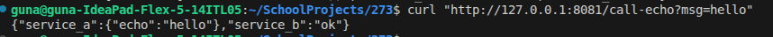
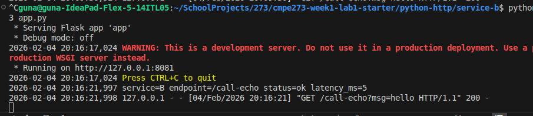
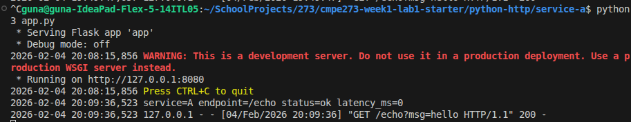
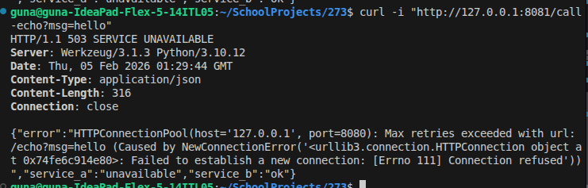
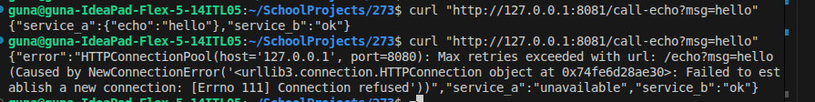
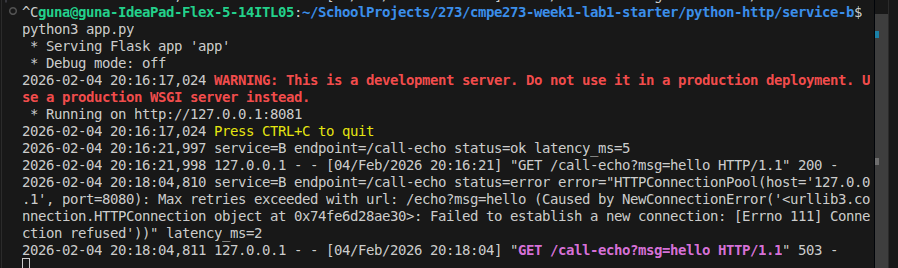

# guna-cmpe273-lab1
## Python HTTP Starter Lab - Guna Vengalasetti


## How to Run:
```bash
cd python-http
pip install -r requirements.txt

# Terminal 1: Start Service A
cd service-a && python app.py

# Terminal 2: Start Service B
cd service-b && python app.py

# Terminal 3: Test
curl "http://127.0.0.1:8081/call-echo?msg=hello"
```
## Success:
Curl Command testing service A & service B:


Service A:




Service B:




## Failure:

Curl Example 1:




Curl Example 2:




Service B:




## Why is it Distributed?

This system is distributed because its parts do not live in the same place. There are two services, each running in its own process on its own network port. When Service B needs something, it makes an HTTP request to Service A and waits up to one second for a response. If Service A does not respond in time, a timeout exception is raised and caught, and Service B returns a 503 with "service_a": "unavailable". If Service A is down entirely, the request fails with a connection error, which is also caught and handled the same way so Service B can fail gracefully instead of crashing. Each service logs the endpoint called, the request status, and the latency in milliseconds. It shows the logs from both services allowing you to trace a request through the system and see exactly where delays or failures occur.

